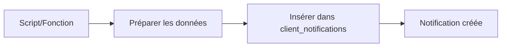
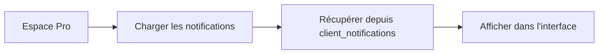

# 🔔 EXPLICATION SIMPLE - COMMENT SONT CRÉÉES LES NOTIFICATIONS

## 📋 **Vue d'ensemble Simple**

Les notifications sont créées en **insérant des données** dans une **table de base de données** appelée `client_notifications`.

---

## 🗄️ **1. La Table de Base de Données**

### **Structure de la Table**
```sql
-- Table client_notifications
CREATE TABLE client_notifications (
    id UUID PRIMARY KEY,                    -- Identifiant unique
    client_id UUID NOT NULL,                -- ID du client Pro
    user_id UUID NOT NULL,                  -- ID de l'utilisateur
    type TEXT NOT NULL,                     -- Type (maintenance, commande, etc.)
    title TEXT NOT NULL,                    -- Titre de la notification
    message TEXT NOT NULL,                  -- Message détaillé
    is_read BOOLEAN DEFAULT FALSE,          -- Lu ou non lu
    priority TEXT NOT NULL,                 -- Priorité (urgent, high, normal, low)
    related_entity_type TEXT,               -- Type d'entité liée (equipment, order)
    related_entity_id TEXT,                 -- ID de l'entité liée
    created_at TIMESTAMP DEFAULT NOW(),     -- Date de création
    updated_at TIMESTAMP DEFAULT NOW()      -- Date de mise à jour
);
```

---

## 🔧 **2. Processus de Création**

### **Étape 1 : Préparer les Données**
```javascript
// Exemple de données pour une notification
const notificationData = {
    client_id: "123e4567-e89b-12d3-a456-426614174000",  // ID du client Pro
    user_id: "user-123",                                 // ID de l'utilisateur
    type: "maintenance_due",                             // Type de notification
    title: "Maintenance préventive urgente",             // Titre
    message: "La maintenance de l'équipement CAT-001 est programmée pour demain", // Message
    is_read: false,                                      // Non lu
    priority: "urgent",                                  // Priorité urgente
    related_entity_type: "equipment",                    // Lié à un équipement
    related_entity_id: "cat-001"                         // ID de l'équipement
};
```

### **Étape 2 : Insérer dans la Base de Données**
```javascript
// Insérer la notification dans la table
const { data, error } = await supabase
    .from('client_notifications')
    .insert([notificationData])
    .select();

if (error) {
    console.error('Erreur lors de la création:', error);
} else {
    console.log('✅ Notification créée:', data);
}
```

---

## 🎯 **3. Méthodes de Création**

### **Méthode A : Script Automatique (Le Plus Simple)**

#### **Comment ça marche :**
1. **Script Node.js** qui se connecte à Supabase
2. **Récupère** un utilisateur et son profil Pro
3. **Prépare** des données de notification
4. **Insère** ces données dans la table `client_notifications`

#### **Exécution :**
```bash
# Lancer le script
node create-notification-example.js
```

#### **Ce que fait le script :**
```javascript
// 1. Se connecter à Supabase
const supabase = createClient(supabaseUrl, supabaseServiceKey);

// 2. Trouver un utilisateur
const { data: users } = await supabase
    .from('user_profiles')
    .select('id, email')
    .limit(1);

// 3. Trouver son profil Pro
const { data: proProfile } = await supabase
    .from('pro_clients')
    .select('id')
    .eq('user_id', users[0].id)
    .single();

// 4. Créer des notifications de test
const testNotifications = [
    {
        client_id: proProfile.id,
        user_id: users[0].id,
        type: 'maintenance_due',
        title: 'Maintenance préventive urgente',
        message: 'La maintenance de l\'équipement CAT-2024-001 est programmée pour demain',
        is_read: false,
        priority: 'urgent',
        related_entity_type: 'equipment',
        related_entity_id: 'cat-2024-001'
    },
    // ... autres notifications
];

// 5. Insérer dans la base de données
const { data } = await supabase
    .from('client_notifications')
    .insert(testNotifications)
    .select();
```

### **Méthode B : API Programmatique**

#### **Comment ça marche :**
1. **Fonctions JavaScript** qui créent des notifications
2. **Appelées** depuis votre code
3. **Insèrent** automatiquement dans la base de données

#### **Exemple d'utilisation :**
```javascript
// Importer la fonction
import { createMaintenanceNotification } from '../utils/proApi';

// Créer une notification
const notification = await createMaintenanceNotification(
    'equipment-123',        // ID de l'équipement
    'Pelle mécanique CAT',  // Nom de l'équipement
    '15/01/2024',          // Date de maintenance
    'urgent'               // Priorité
);
```

#### **Ce que fait la fonction :**
```javascript
export async function createMaintenanceNotification(equipmentId, equipmentName, maintenanceDate, priority) {
    // 1. Récupérer l'utilisateur connecté
    const { data: { user } } = await supabase.auth.getUser();
    
    // 2. Récupérer son profil Pro
    const proProfile = await getProClientProfile();
    
    // 3. Préparer les données
    const notification = {
        client_id: proProfile.id,
        user_id: user.id,
        type: 'maintenance_due',
        title: `Maintenance préventive - ${equipmentName}`,
        message: `La maintenance préventive de l'équipement ${equipmentName} est programmée pour le ${maintenanceDate}`,
        priority,
        related_entity_type: 'equipment',
        related_entity_id: equipmentId
    };
    
    // 4. Insérer dans la base de données
    const { data } = await supabase
        .from('client_notifications')
        .insert([notification])
        .select()
        .single();
    
    return data;
}
```

---

## 🔄 **4. Flux Complet**

### **Étape 1 : Création**


### **Étape 2 : Affichage**


### **Étape 3 : Actions**
```mermaid
graph LR
    A[Utilisateur clique] --> B[Action (marquer comme lu)]
    B --> C[Mettre à jour client_notifications]
    C --> D[Interface se met à jour]
```

---

## 🎯 **5. Exemples Concrets**

### **Exemple 1 : Notification de Maintenance**
```javascript
// Données insérées dans la base
{
    "id": "uuid-123",
    "client_id": "client-456",
    "user_id": "user-789",
    "type": "maintenance_due",
    "title": "Maintenance préventive - Pelle CAT",
    "message": "La maintenance préventive de l'équipement Pelle CAT est programmée pour le 15/01/2024",
    "is_read": false,
    "priority": "urgent",
    "related_entity_type": "equipment",
    "related_entity_id": "cat-001",
    "created_at": "2024-01-10T10:30:00Z"
}
```

### **Exemple 2 : Notification de Commande**
```javascript
// Données insérées dans la base
{
    "id": "uuid-456",
    "client_id": "client-456",
    "user_id": "user-789",
    "type": "order_update",
    "title": "Commande CMD-001 - Livrée",
    "message": "Votre commande CMD-001 a été mise à jour avec le statut: Livrée",
    "is_read": false,
    "priority": "normal",
    "related_entity_type": "order",
    "related_entity_id": "cmd-001",
    "created_at": "2024-01-10T11:00:00Z"
}
```

---

## 🛠️ **6. Comment Tester**

### **Test Simple :**
```bash
# 1. Créer des notifications de test
node create-notification-example.js

# 2. Vérifier dans l'interface
# Aller sur #pro → Notifications

# 3. Voir les notifications créées
```

### **Résultat Attendu :**
- ✅ **5 notifications** apparaissent dans l'interface
- ✅ **Code couleur** selon la priorité
- ✅ **Icônes** selon le type
- ✅ **Actions** fonctionnelles (marquer comme lu, etc.)

---

## 🔍 **7. Vérification dans la Base de Données**

### **Voir toutes les notifications :**
```sql
SELECT * FROM client_notifications ORDER BY created_at DESC;
```

### **Compter les notifications :**
```sql
SELECT COUNT(*) FROM client_notifications;
```

### **Voir les notifications non lues :**
```sql
SELECT * FROM client_notifications WHERE is_read = false;
```

---

## 🎉 **Résumé Simple**

**Les notifications sont créées en :**

1. **📝 Préparant** des données (titre, message, priorité, etc.)
2. **🗄️ Insérant** ces données dans la table `client_notifications`
3. **🖥️ Affichant** automatiquement dans l'interface utilisateur
4. **⚡ Permettant** des actions (marquer comme lu, voir détails, etc.)

**C'est tout ! Les notifications ne sont que des données dans une base de données qui s'affichent dans l'interface.** 